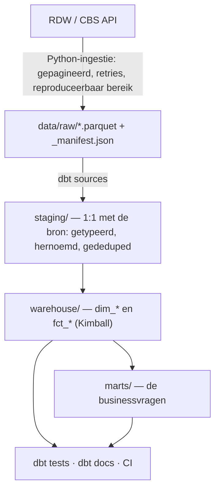
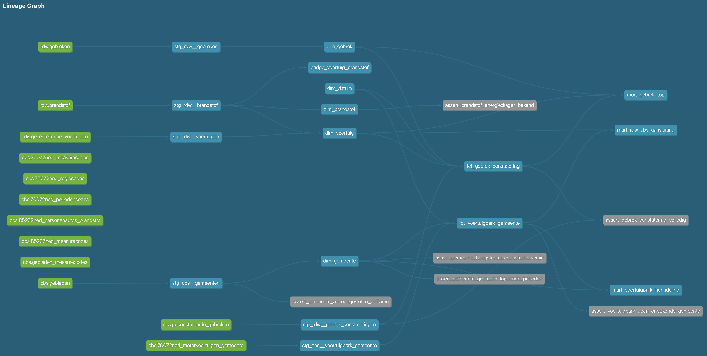
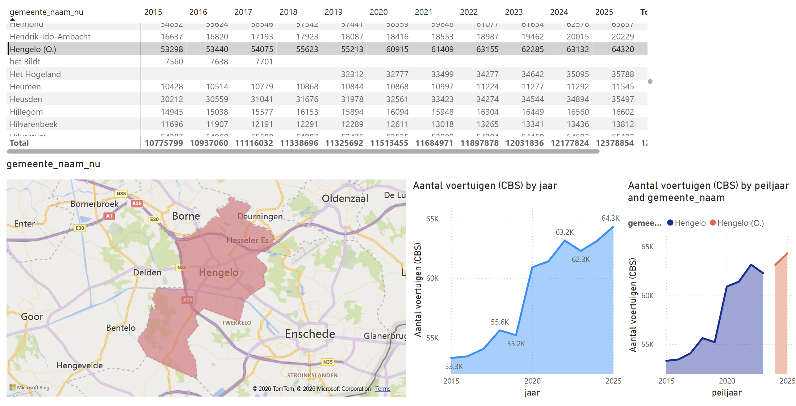
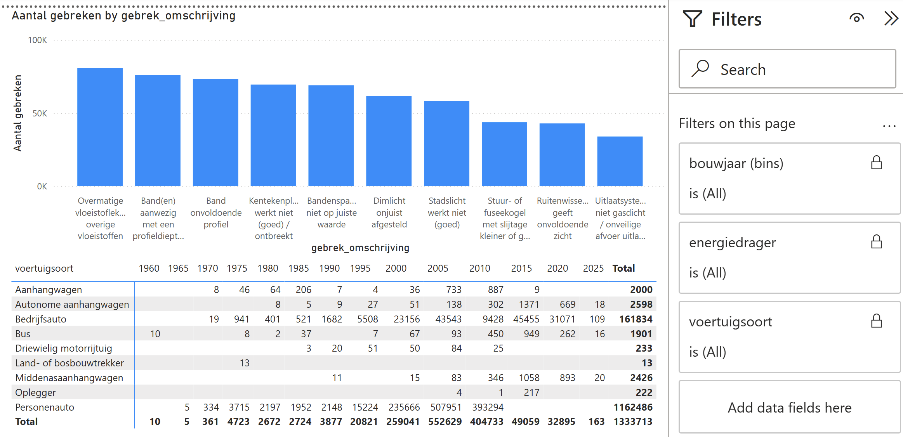
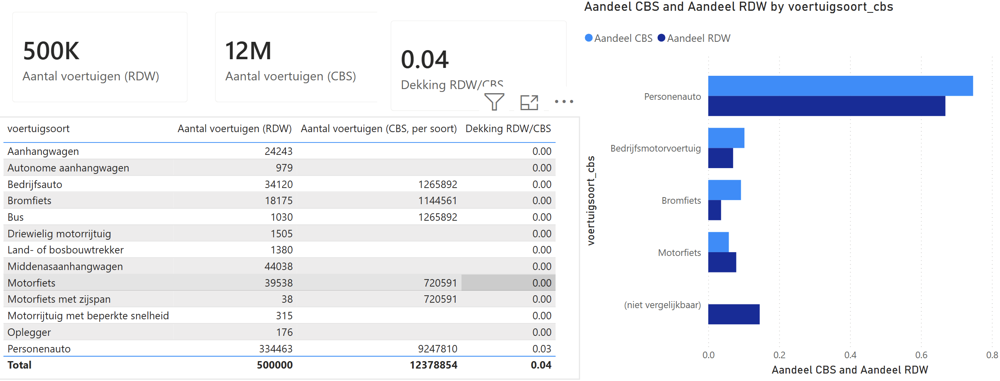

# open-data-warehouse

**End-to-end ELT-platform op Nederlandse open data, met een gedocumenteerd
Kimball-sterschema.**

Python-ingestie → warehouse → dbt (staging → sterschema → marts) → tests, docs en CI.
Gebouwd zoals een data-platformteam het oplevert: versiebeheer, code review,
geautomatiseerde tests en een lineage die klopt.

> **Status:** in aanbouw. Zie [Definition of done](#definition-of-done) voor wat er staat
> en wat nog niet. Claims in deze README die nog niet waar zijn, staan als openstaand
> vinkje — niet als proza.

## Data

Twee publieke bronnen, allebei zonder API-sleutel te bevragen:

| Bron | Wat | Rol in het model |
| --- | --- | --- |
| [RDW open data](https://opendata.rdw.nl) | gekentekende voertuigen, brandstof, geconstateerde gebreken | transactiefeiten (miljoenen rijen) |
| [CBS StatLine](https://opendata.cbs.nl) (odata) | motorvoertuigenpark en gemeentelijke indeling | snapshotfeit + gemeentedimensie |

De combinatie is bewust gekozen: RDW levert feiten op recordniveau, CBS levert een
periodieke snapshot op gemeenteniveau. Twee feiten met een verschillende grain in
één schema is precies waar dimensioneel modelleren over gaat — en waar het misgaat
als je de grain niet expliciet maakt.

Elke ingestie legt een **snapshotdatum** vast en de selectiequery staat in de repo,
zodat een run reproduceerbaar is.

Zie **[docs/data.md](docs/data.md)** voor wat er precies wordt opgehaald: de dataset-id's,
de grain per bestand, de steekproefopzet en de controles daarop. De data zelf staat niet
in git — `make ingest` haalt hem op.

## Architectuur



DuckDB omdat het gratis is en in CI draait. Hetzelfde dbt-project richt zich met een
ander profiel op Snowflake of Databricks; de modellen zijn daarop geschreven (geen
DuckDB-specifieke SQL buiten `staging/`).

De lineage zoals dbt hem uit de `ref()`'s afleidt (stand: commit 15, incl. marts):



## Het sterschema

Per feittabel staat de **grain** expliciet — één zin, geen interpretatie mogelijk.

| Feittabel | grain (één rij per …) | Type | Dimensies |
| --- | --- | --- | --- |
| `fct_gebrek_constatering` | geconstateerd gebrek per keuring per voertuig | transactie | datum, voertuig, gebrek |
| `fct_voertuigpark_gemeente` | gemeente per peiljaar per voertuigsoort | periodieke snapshot | datum, gemeente |

| Dimensie | SCD | Waarom |
| --- | --- | --- |
| `dim_datum` | — | gegenereerd, met NL-feestdagen en kwartaal/weeknummers |
| `dim_gemeente` | **type 2** | gemeentelijke herindelingen; historische feiten moeten aan de gemeente van tóen hangen |
| `dim_voertuig` | type 1 | kenteken met gedenormaliseerde typekenmerken; correcties zijn correcties, geen historie |
| `dim_brandstof` | type 1 | kleine, stabiele referentielijst |
| `dim_gebrek` | type 1 | RDW-gebrekcode met omschrijving en geldigheidsperiode |
| `bridge_voertuig_brandstof` | — | 12.671 voertuigen hebben meer dan één brandstof; de bridge voorkomt dubbeltellen |

## Snel starten

```bash
make all         # hele keten: install -> ingest (alleen bij lege data/raw/) -> build
```

Of stap voor stap:

```bash
make install     # dependencies (uv/pip) + dbt packages
make ingest      # haalt een snapshot op naar data/raw/
make build       # dbt build: modellen + tests
make docs        # dbt docs generate && serve
```

`make` zonder argument toont de targets — bewust, want een kale `make` die ongevraagd
een half uur gaat ingesten is onvriendelijker dan een die eerst laat zien wat er kan.

## Power BI

Een Power BI-rapport ([`powerbi/open-data-warehouse.pbix`](powerbi/open-data-warehouse.pbix))
beantwoordt de drie businessvragen rechtstreeks op het sterschema. Het semantisch
model spiegelt het schema en repareert het niet: relaties 1:\* van dimensie naar
feit met enkelzijdig kruisfilter, behalve de bridge — die staat als many-to-many
met één bidirectioneel kruisfilter, zodat "gebreken per energiedrager" werkt
zonder dubbeltellen. De SCD2-gemeentedimensie hangt aan het snapshotfeit via de
**surrogaatsleutel**, waardoor de temporele join uit het warehouse behouden
blijft. De DAX-measures spiegelen de marts (som over de maat `aantal_gebreken`,
soortenmapping en laatste peiljaar voor de RDW/CBS-vergelijking) en de totalen
zijn gekruist met `dbt show`.







Zelf openen: `make build && make exports`, open het `.pbix` in Power BI Desktop
en pas de Power Query-parameter `ExportsMap` aan naar het eigen pad van
`exports/`.

## Ontwerpkeuzes

- **Waarom deze grain.** `fct_gebrek_constatering` staat op geconstateerd gebrek, niet
  op keuring: gebreken tellen is dan gewoon `count(*)`. De bronkolom met het
  keuringtotaal is bewust weggelaten — die herhaalt hetzelfde getal op elke regel van
  de keuring, en `sum()` telt dan dubbel.
- **Waarom SCD2 op gemeente.** Nederland herindeelt gemiddeld elk jaar wel iets. Zonder
  type 2 verschuiven historische cijfers met terugwerkende kracht — een klassieke
  stille fout in stuurinformatie.
- **Waarom een deterministisch kentekenbereik.** De volledige RDW-set is ~58 miljoen
  rijen. De standaardrun bepaalt één op kenteken gesorteerd bereik en haalt álle sets op
  datzelfde bereik op — één voertuigpopulatie, reproduceerbaar zolang de bron niet
  wijzigt (zie [docs/data.md](docs/data.md)). Opschalen is één variabele
  (`SAMPLE_SIZE`).
- **Waarom DuckDB.** Nul kosten, draait in CI, één bestand om te reviewen. De
  warehouse-keuze is geen onderdeel van de modellering — dat is juist het punt.
- **Waarom geen dashboardtool met een server.** Een statische Evidence-pagina is
  klikbaar vanaf GitHub zonder dat iemand iets hoeft te installeren.

## Kwaliteit en CI

Bij elke pull request draait GitHub Actions:

| Stap | Wat |
| --- | --- |
| lint | `ruff` (Python) en `sqlfluff` (dbt SQL) |
| build | `dbt build` tegen DuckDB — modellen én tests |
| docs | `dbt docs generate`, resultaat als artifact |

dbt-tests: `unique` en `not_null` op elke sleutel, `relationships` van elke
foreign key naar de dimensie, `accepted_values` op de referentiekolommen, plus
eigen tests op de grain (geen dubbele rijen per graindefinitie).

## Definition of done

- [x] Repo met ingestie + dbt-project, end-to-end draaibaar met één `make`-commando
- [x] ≥ 2 feittabellen en ≥ 4 dimensies, grain gedocumenteerd per feittabel
- [x] dbt-tests groen in GitHub Actions bij elke PR
- [x] README met architectuurdiagram, lineage-screenshot en ontwerpkeuzes
- [ ] Evidence- of Streamlit-pagina over de marts (optioneel)
- [x] Getagde release v1.0

## Wat dit project laat zien

SQL en dimensioneel modelleren (Kimball) · ELT-pipelines met dbt · reproduceerbare
ingestie in Python · datakwaliteitstests · CI/CD en een PR-workflow · een
warehouse-opzet die overzet naar een cloud data platform.

## Bronnen en licentie

RDW- en CBS-data zijn open data; zie de voorwaarden van de betreffende bron. De code in
deze repo staat onder [LICENSE](LICENSE). Data wordt niet meegeleverd in git —
`make ingest` haalt een verse snapshot op.
